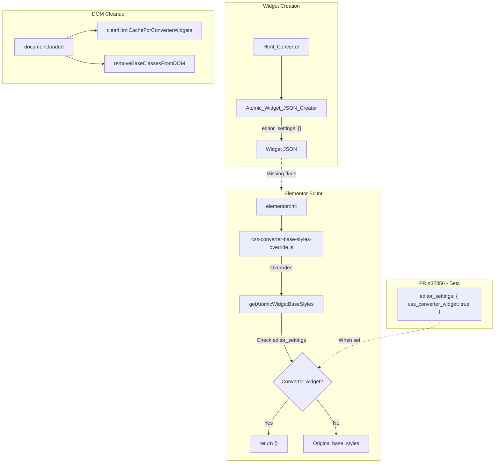

# PR #32856 Logic Mapping

Complete mapping of existing logic from PR #32856 (hein/convert-css-to-widgets) for implementing equivalent behavior in elementor-html-css-converter without modifying Elementor core.

---

## 1. Widget Identification Parameters

### Parameters Added to Converted Widgets

| Parameter | Location | Purpose |
|-----------|----------|---------|
| `editor_settings['css_converter_widget']` | `element_data['editor_settings']` | Primary flag marking widget as created by CSS converter |
| `editor_settings['disable_base_styles']` | `element_data['editor_settings']` | Alternative flag to disable base styles (checked in JS override) |
| `version` | `element_data['version']` | When `'0.0'` used as fallback detector for converter widgets |

### Detection Logic (PHP - module.php)

```php
private function element_has_css_converter_flag( array $element_data ): bool {
    return isset( $element_data['editor_settings']['css_converter_widget'] ) 
        && $element_data['editor_settings']['css_converter_widget'];
}
```

### Detection Logic (JavaScript - css-converter-base-styles-override.js)

```javascript
const isConverterWidget = 
    true === editorSettings.disable_base_styles ||
    true === editorSettings.css_converter_widget ||
    '0.0' === model?.get?.( 'version' );
```

### Current elementor-html-css-converter Status

| Parameter | PR #32856 | elementor-html-css-converter |
|-----------|-----------|------------------------------|
| `css_converter_widget` | Sets `true` | Does NOT set |
| `disable_base_styles` | Sets optionally | Does NOT set |
| `editor_settings` | `['css_converter_widget' => true]` | `[]` (empty) |

**Gap:** Atomic_Widget_JSON_Creator calls `->editor_settings( [] )` - empty array. Must add `['css_converter_widget' => true, 'disable_base_styles' => true]` for base styles override to work.

---

## 2. Base Styles Override System

### 2.1 Hook Registration (module.php)

```php
private function register_base_styles_override_hooks(): void {
    add_action( 'elementor/editor/before_enqueue_scripts', [ $this, 'enqueue_base_styles_override_script' ], 10 );
    add_action( 'elementor/editor/before_enqueue_scripts', [ $this, 'enqueue_variables_reload_script' ], 10 );
    add_action( 'elementor/frontend/after_enqueue_scripts', [ $this, 'enqueue_fix_document_handles_script' ], 10 );
}

public function enqueue_base_styles_override_script(): void {
    wp_enqueue_script(
        'css-converter-base-styles-override',
        plugins_url( 'modules/atomic-widgets/assets/js/editor/css-converter-base-styles-override.js', $plugin_file ),
        [ 'jquery', 'elementor-editor' ],
        '1.0.0',
        true
    );
}
```

### 2.2 JavaScript Override (css-converter-base-styles-override.js)

**Location:** `modules/atomic-widgets/assets/js/editor/css-converter-base-styles-override.js`

**Behavior:**

1. **Override getAtomicWidgetBaseStyles:**
   - Hooks on `elementor:init`
   - Replaces `elementor.helpers.getAtomicWidgetBaseStyles`
   - For converter widgets: returns `{}` (no base classes)
   - For other widgets: calls original function

2. **Document Loaded Handler:**
   - Hooks on `elementor.document:loaded`
   - Calls `clearHtmlCacheForConverterWidgets()` - recurses elements, clears htmlCache for converter widgets
   - Calls `removeBaseClassesFromDOM()` - strips `-base` classes from DOM (e-paragraph-base, e-heading-base, e-button-base, e-div-block-base)

3. **htmlCache Clear Logic:**
   - For each widget with converter flag: `model.setHtmlCache( null )`
   - If widget has `remoteRender`: triggers `renderRemoteServer()`
   - Tracks pending renders, reloads preview when complete

4. **DOM Base Class Removal:**
   - Selects `[class*="-base"]`
   - Removes classes matching: `e-paragraph-*`, `e-heading-*`, `e-button-*`, `e-div-block-*` containing `-base`

---

## 3. Conditional Loading (page_has_css_converter_widgets)

```php
private function page_has_css_converter_widgets( int $post_id ): bool {
    $document = \Elementor\Plugin::$instance->documents->get( $post_id );
    if ( ! $document ) return false;
    $elements_data = $document->get_elements_data();
    return $this->traverse_elements_for_css_converter_widgets( $elements_data );
}

private function traverse_elements_for_css_converter_widgets( array $elements_data ): bool {
    foreach ( $elements_data as $element_data ) {
        if ( $this->element_has_css_converter_flag( $element_data ) ) return true;
        if ( isset( $element_data['elements'] ) && is_array( $element_data['elements'] ) ) {
            if ( $this->traverse_elements_for_css_converter_widgets( $element_data['elements'] ) ) return true;
        }
    }
    return false;
}
```

**Usage:** Could conditionally enqueue base-styles-override.js only when document has converter widgets. PR currently enqueues unconditionally.

---

## 4. Elementor Core Modifications (PR - Require Core Changes)

### 4.1 core/files/css/base.php

- Adds `Css_Output_Optimizer` integration
- New method `optimize_css_output()` - removes empty CSS rules
- Parses CSS string to rules, runs optimizer, converts back
- **Path note:** References `elementor-css/modules/css-converter/` (external plugin) for optimizer - suggests split architecture

### 4.2 core/modules-manager.php

- Registers `css-converter` in module lists

### 4.3 core/base/document.php

- Adds `error_log` for skipped elements (debug)

---

## 5. CSS Converter Module Structure (PR)

```
modules/css-converter/
├── module.php                    # register_base_styles_override_hooks, element_has_css_converter_flag
├── admin/                        # Admin menu, assets
├── assets/js/editor/
│   ├── variables-reload.js
│   └── fix-document-handles.js
├── services/
│   ├── styles/
│   │   ├── css-converter-global-classes-override.php
│   │   └── css-converter-global-styles.php
│   └── widgets/
│       ├── atomic-widget-data-formatter.php  # Sets css_converter_widget, style IDs
│       ├── elementor-document-manager.php
│       └── widget-cache-manager.php
├── convertors/                   # Property mappers (background, border, etc.)
├── parsers/
├── routes/
└── docs/
```

**Note:** Base styles override JS lives in `modules/atomic-widgets/assets/js/editor/` not in css-converter - because it overrides atomic widgets behavior.

---

## 6. Implementation Checklist for elementor-html-css-converter

To replicate PR #32856 base styles behavior **without modifying Elementor**:

| # | Task | Location | Status |
|---|------|----------|--------|
| 1 | Add `editor_settings['css_converter_widget'] = true` to created widgets | Atomic_Widget_JSON_Creator | NOT DONE |
| 2 | Add `editor_settings['disable_base_styles'] = true` optionally | Atomic_Widget_JSON_Creator | NOT DONE |
| 3 | Create css-converter-base-styles-override.js | assets/js/editor/ | NOT DONE |
| 4 | Enqueue override script on elementor/editor/before_enqueue_scripts | Plugin bootstrap | NOT DONE |
| 5 | Optionally: enqueue only when document has converter widgets | Plugin bootstrap | NOT DONE |

---

## 7. Data Flow Summary



---

## 8. Files to Create/Modify in elementor-html-css-converter

### Create
- `assets/js/editor/css-converter-base-styles-override.js` - Port from PR (adjust plugin URL/path)

### Modify
- `includes/converters/html/class-atomic-widget-json-creator.php` - Change `->editor_settings( [] )` to `->editor_settings( [ 'css_converter_widget' => true, 'disable_base_styles' => true ] )`
- `includes/plugin.php` or main loader - Add hook to enqueue override script on `elementor/editor/before_enqueue_scripts`

### Optional
- Add conditional enqueue: only load override when `page_has_css_converter_widgets()`
