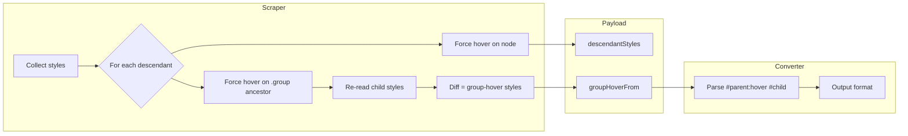

# Group-Hover Support Research

Assessing feasibility of supporting Tailwind-style group-hover (parent hover triggers child styles) without relying on `custom_css`. The converter currently only supports flat per-element styles.

## Current State: Flat Styles Only

| Pattern | Supported | Where |
|---------|-----------|-------|
| `#id { ... }` | Yes | [class-id-style-extractor.php](../../includes/converters/html/class-id-style-extractor.php) |
| `#id:hover`, `#id:focus` | Yes | Same file, `REGEX_ID_PSEUDO_SELECTOR_PATTERN` |
| `#parent:hover #child { ... }` | No | Not parsed |
| `.group:hover .child { ... }` | No | Nested/descendant skipped per [global-classes-import-with-html.md](../archive/planning/global-classes-import-with-html.md) |

The scraper forces `:hover` per node individually via `CSS.forcePseudoState(nodeId, ['hover'])`, so it never captures child styles that depend on parent hover.

## Elementor Interactions: How They Work

Interactions animate the **element they are attached to**. There is no target or selector for child elements.

**Data flow:**
1. Element has `interactions` in its data (array of `interaction-item`)
2. Frontend adds `data-interaction-id` to the element wrapper
3. Interactions handler collects and outputs JSON
4. JS finds `[data-interaction-id="elementId"]` and animates **that element**

**Interaction structure:**
```ts
{
  $$type: 'interaction-item',
  value: {
    interaction_id?: StringPropValue;
    trigger: StringPropValue;   // 'load' | 'scrollIn' | 'scrollOut' | 'scrollOn' | 'hover' | 'click'
    animation: AnimationPresetPropValue;  // effect, type, direction, timing_config, config
    breakpoints?: InteractionBreakpointsPropValue;
  }
}
```

No `target` or `selector` field exists. The animation always runs on the element with `data-interaction-id`.

## Why Interactions Cannot Do Group-Hover

| Requirement | Interactions | Result |
|-------------|-------------|--------|
| Trigger: parent hover | Yes – trigger can be `hover` | Works |
| Target: child element | No – no target/selector | Missing |
| Effect: scale child | Yes – `effect: 'scale'` | Works on self only |

For group-hover we need: **parent** receives hover → **child** animates. Interactions only support: **element** receives trigger → **same element** animates.

## Options

### Option A: custom_css on Parent

Add parsed `#parent:hover #child` rules to the parent widget's `custom_css` as `selector:hover .child-class { ... }`. Elementor supports this natively.

**Pros:** Works today, no core changes  
**Cons:** User requested to avoid custom_css

### Option B: Extend Elementor Interactions with `target` Field

Add `target?: StringPropValue` (e.g. CSS selector like `img`) to the interaction structure. Frontend would animate `parent.querySelector(target)` instead of the parent when trigger fires.

**Pros:** Clean, uses native Interactions  
**Cons:** Requires modifying Elementor core; depends on upstream acceptance

### Option C: Converter Plugin Frontend Override

Enqueue a script that reads interactions with a custom `target` field and implements parent-hover → child animation via Motion.animate.

**Pros:** No Elementor core changes; converter owns the behavior  
**Cons:** Non-standard format; must coexist with real Interactions

### Option D: Interaction on Child (Direct Hover)

Put the scale interaction on the image widget. Hovering the image scales it.

**Pros:** Uses native Interactions as-is  
**Cons:** Not group-hover; different UX (smaller hit area)

## Implementation Approach (Scraper + Converter)

Regardless of output format (custom_css vs Interactions), the scraper and converter need to capture and represent group-hover:



**Scraper changes:** In subtree-style-collector, for each descendant with a `.group` ancestor, force `:hover` on that ancestor and re-read the child's computed styles. Add `groupHoverFrom` and `groupHover` to payload when styles differ.

**Converter changes:** Parse `#parent:hover #child { ... }` (from scraper-emitted CSS or payload). Map to parent widget ID → child widget ID → styles. Output via custom_css (Option A) or interaction with target (Option B/C).

## Recommendation

Interactions cannot natively support group-hover without a `target` extension. Viable paths:

1. **custom_css** – Implementable now; user preference is to avoid.
2. **Elementor `target` PR** – Propose upstream; converter would emit interactions with `target: "img"`.
3. **Plugin frontend script** – Converter emits custom `target`; plugin script animates children on parent hover. No core changes, non-standard format.
